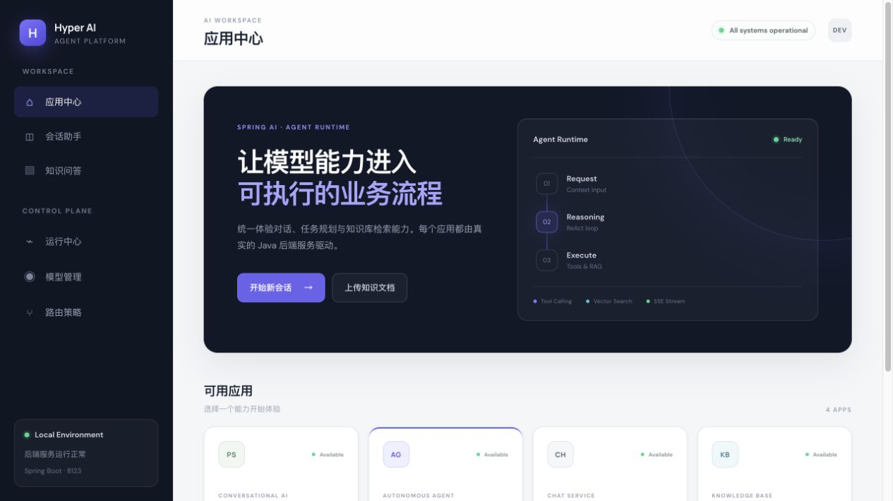
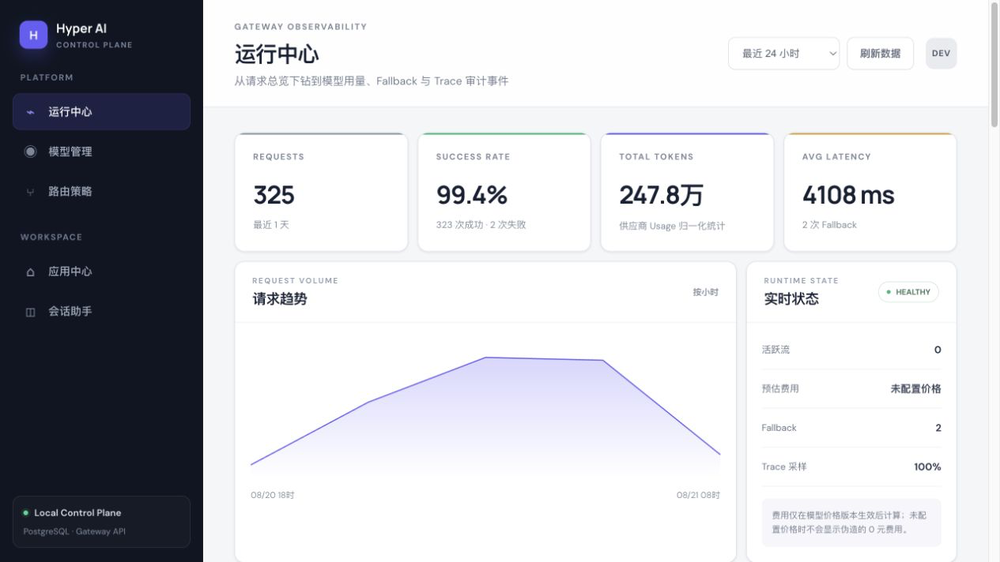
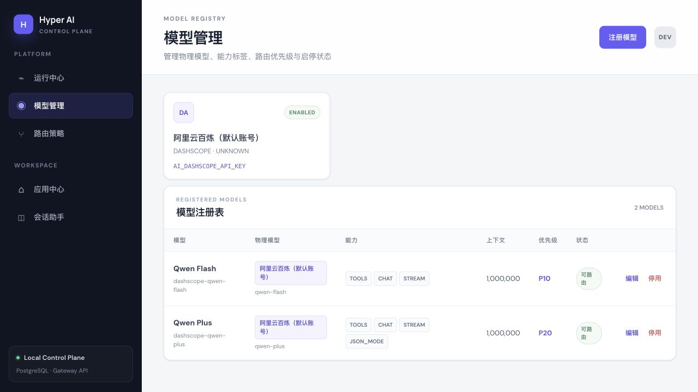
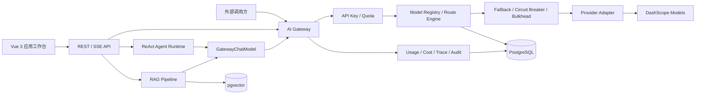

<div align="center">

# Hyper AI Agent

**以 AI Gateway 为统一模型入口，整合 Agent、RAG、Tool Calling 与运行监控的 Java AI 应用后端。**


</div>



## 项目简介

Hyper AI Agent 是一个前后端分离的 AI 应用项目。后端基于 Java 21、Spring Boot 和 Spring AI，将模型注册、路由、流式代理、Fallback、限流、Token 计量与 Trace 审计收敛到统一的 AI Gateway；在此基础上提供 ReAct 任务智能体、心理咨询 RAG、多会话助手和 PDF 文档问答。

项目当前重点是把模型能力组织成可配置、可执行、可观察的后端链路，而不是只封装一次模型调用。

## 核心能力

| 模块 | 已实现能力 |
| --- | --- |
| **AI Gateway** | 统一 Chat Completions 接口、模型与 Provider 注册、按能力动态路由、同步/SSE 流式代理、Fallback |
| **稳定性治理** | API Key 鉴权、请求与并发配额、模型级 Circuit Breaker、Bulkhead 隔离、输入边界校验 |
| **运行监控** | 请求量、成功率、延迟、Token 用量、费用估算、Fallback 统计、Trace 与审计事件 |
| **任务智能体** | ReAct 多步骤执行、工具选择、阶段事件流、最多 7 轮执行、AskHuman、手动终止与最终结果收束 |
| **RAG** | PDF/Markdown 解析、文本切分、Embedding、pgvector 向量检索、文档过滤与上下文增强 |
| **工具调用** | 统一工具注册，支持网页搜索、网页抓取、资源下载、文件操作、PDF 生成与受限终端执行 |
| **应用工作台** | 应用中心、运行中心、模型管理、路由策略、会话助手、任务智能体与文档知识问答 |

## 界面预览

### AI Gateway 运行中心

运行中心从聚合指标下钻到模型用量和审计事件，展示真实请求数据；未配置模型价格时不会伪造费用。



### 模型注册与管理

模型、物理 Provider、能力标签、上下文窗口、路由优先级和启停状态均由后端注册表统一管理。



## 系统架构



### Gateway 请求链路

1. **身份与配额**：解析 Bearer API Key，校验调用方状态、分钟请求量和并发额度。
2. **能力路由**：根据 `route`、指定模型及 `CHAT`、`STREAM`、`TOOLS` 等能力筛选候选模型。
3. **故障隔离**：以 Provider 账号和模型为粒度执行熔断与并发隔离，符合条件的上游故障自动切换候选模型。
4. **流式与计量**：统一同步响应和 SSE 事件，归一化 Token Usage，并按生效价格版本估算费用。
5. **可观测记录**：写入 Trace、路由结果、Fallback、耗时、用量和审计事件，不记录 Prompt、回复正文及密钥。

## 技术栈

| 分层 | 技术 |
| --- | --- |
| 后端基础 | Java 21、Spring Boot 3.5.10、Spring MVC、Reactor |
| AI 框架 | Spring AI 1.1.2、Spring AI Alibaba 1.1.2.3、DashScope |
| 网关治理 | Resilience4j 2.4.0、Caffeine、Micrometer Tracing、OpenTelemetry Bridge |
| 数据存储 | PostgreSQL、pgvector、Flyway、Spring JDBC |
| RAG 与文档 | Spring AI VectorStore、PDFBox、Tess4J、jsoup |
| 前端 | Vue 3、Vue Router、Axios、Vite 5、PDF.js |
| 工程化 | Maven Wrapper、JUnit 5、Spring Boot Test |

## 目录结构

```text
hyper-ai-agent/
├── src/main/java/com/yzz/hyperaiagent/
│   ├── gateway/                  # AI Gateway：API、应用层、领域层与基础设施
│   ├── agent/                    # ReAct Agent 与结构化运行时
│   ├── rag/                      # 文档加载、切分与向量检索
│   ├── tools/                    # Tool Calling 与本地沙箱
│   ├── controller/               # 对话、Agent、PDF 与健康检查接口
│   └── repository/               # 会话与 PDF 本地存储
├── src/main/resources/
│   ├── db/migration/             # Gateway 数据库迁移
│   └── application.yml           # 公共配置
├── hyper-ai-agent-frontend/      # Vue 3 应用工作台与控制面
├── docs/images/                  # README 页面截图
├── src/test/                     # 单元测试与集成测试
├── .env.example                  # 环境变量模板
└── pom.xml
```

## 快速开始

### 1. 环境要求

- JDK 21
- Node.js 18+
- PostgreSQL 15+ 与 pgvector 扩展
- 可用的 DashScope API Key

### 2. 创建本地数据库

```bash
createdb yu_ai_agent
psql -d yu_ai_agent -c "CREATE EXTENSION IF NOT EXISTS vector;"
```

在项目根目录创建不会提交到 Git 的 `application-local.yml`：

```yaml
spring:
  datasource:
    url: jdbc:postgresql://localhost:5432/yu_ai_agent
    username: postgres
    password: ${PG_PASSWORD:}
  ai:
    dashscope:
      api-key: ${AI_DASHSCOPE_API_KEY}
```

Flyway 会在应用启动时自动创建 AI Gateway 所需表结构并写入本地默认路由。

### 3. 配置模型与工具密钥

```bash
cp .env.example .env
```

按需填写 `.env`，至少配置：

```properties
AI_DASHSCOPE_API_KEY=your_key
DASHSCOPE_API_KEY=your_key
SEARCH_API_KEY=your_search_key
```

`.env`、`application-local.yml` 和真实密钥均已从版本控制中排除。

### 4. 启动后端

```bash
./mvnw spring-boot:run -Dspring-boot.run.profiles=local
```

后端默认地址：`http://localhost:8123/api`

### 5. 启动前端

```bash
cd hyper-ai-agent-frontend
npm ci
npm run dev
```

前端默认地址：`http://localhost:5174`

## 调用 AI Gateway

### 同步请求

```bash
curl --request POST 'http://localhost:8123/api/gateway/v1/chat/completions' \
  --header 'Content-Type: application/json' \
  --header 'Accept: application/json' \
  --data '{
    "route": "general-chat",
    "messages": [
      {"role": "user", "content": "请介绍这个项目的核心能力"}
    ],
    "stream": false,
    "temperature": 0.7
  }'
```

### SSE 流式请求

```bash
curl --no-buffer --request POST \
  'http://localhost:8123/api/gateway/v1/chat/completions' \
  --header 'Content-Type: application/json' \
  --header 'Accept: text/event-stream' \
  --data '{
    "route": "general-chat",
    "messages": [
      {"role": "user", "content": "用三点说明 Spring AI 的作用"}
    ],
    "stream": true
  }'
```

`local` Profile 默认允许本机匿名调用。其他环境应关闭匿名访问，并使用：

```http
Authorization: Bearer <gateway-api-key>
```

## 默认路由

| 路由 | 首选模型 | Fallback | 使用场景 |
| --- | --- | --- | --- |
| `general-chat` | Qwen Flash | Qwen Plus | 通用对话 |
| `psychology-chat` | Qwen Plus | Qwen Flash | 心理咨询 RAG |
| `pdf-rag` | Qwen Plus | Qwen Flash | PDF 文档问答 |
| `agent-tool-calling` | Qwen Plus | Qwen Flash | ReAct 与工具调用 |

默认配置仅用于本地启动，模型和路由可通过管理页面或管理 API 调整。

## 主要接口

| 接口 | 方法 | 说明 |
| --- | --- | --- |
| `/api/gateway/v1/chat/completions` | POST | Gateway 同步或 SSE 流式模型调用 |
| `/api/gateway/admin/providers` | GET / POST | Provider 配置管理 |
| `/api/gateway/admin/models` | GET / POST | 模型注册与查询 |
| `/api/gateway/admin/routes` | GET / POST / PUT | 路由配置与更新 |
| `/api/gateway/admin/observability/overview` | GET | Gateway 聚合指标 |
| `/api/gateway/admin/observability/trace` | GET | Trace 与审计事件查询 |
| `/api/ai/manus/chat` | GET | 启动任务智能体 SSE 运行 |
| `/api/ai/manus/runs/{runId}/resume` | GET | 提交 AskHuman 回答并继续运行 |
| `/api/ai/manus/runs/{runId}/cancel` | POST | 手动终止任务智能体 |
| `/api/ai/psy_app/chat/sse` | GET | 心理咨询流式对话 |
| `/api/ai/pdf/upload/{chatId}` | POST | 上传并解析 PDF |
| `/api/ai/pdf/chat` | GET | 基于指定文档进行问答 |

管理接口在当前阶段仅允许 `local` Profile 下由本机环回地址访问。

## 安全设计

- Provider 密钥只通过环境变量解析，数据库仅保存 `credentialRef`。
- Gateway 请求不允许客户端指定 Provider Base URL 或直接传递供应商密钥。
- 审计数据不保存 Prompt、模型回复正文和认证信息。
- 终端工具通过命令白名单、工作目录边界和超时机制限制本地执行范围。
- Agent 支持最大步骤数、卡死检测、人工确认和服务端主动取消。

## 验证

```bash
# 后端测试
./mvnw test

# 前端生产构建
cd hyper-ai-agent-frontend
npm run build
```

## 当前边界

- 当前内置 Provider Adapter 为 DashScope，其他 Provider 可通过 `ModelProviderAdapter` 扩展。
- 配额和熔断状态目前面向单实例运行；多实例部署需要接入共享限流与状态组件。
- 管理 API 当前采用本机访问边界，尚未引入完整的用户、租户和 RBAC 体系。
- 项目仍在持续开发，接口和数据库结构可能随模块演进调整。
